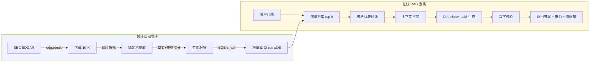

# Fin Research Agent

> 财报 RAG 智能问答系统 — 基于 SEC 10-K 年报的检索增强生成

## 项目定位

从 32 家 S&P 500 公司的 SEC 10-K 年报中自动提取、解析、分块、向量化，构建可语义检索的知识库，并通过 DeepSeek LLM 生成准确的、有据可查的自然语言财务回答。

### 核心能力

- ✅ **自然语言查财报**：问"Apple 2025 年营收多少"直接返回 $416,161M，带来源标注
- ✅ **数字校验**：LLM 生成的所有数字均与检索上下文交叉验证，不捏造
- ✅ **拒答边界**：超出财报范围的问题（"明天股票涨吗"）正确拒绝
- ✅ **多行业覆盖**：科技、消费、金融、医疗 4 大行业 32 家公司

## 架构



## 数据规模

| 指标 | 数值 |
|------|------|
| 覆盖公司 | 32 家（科技 12 / 消费 8 / 金融 7 / 医疗 5） |
| 10-K 年报 | 97 份（每家公司最近 3 年） |
| 智能分块 | 25,822 blocks |
| 表格提取 | 9,366 张 |
| 向量维度 | 384 (BGE-small-en-v1.5) |
| 总字符数 | 42,283,837 |

## 快速启动

### 1. 环境准备

```bash
git clone https://github.com/dudu12392/fin-research-agent.git
cd fin-research-agent
poetry install
cp .env.example .env
# 编辑 .env，填入你的 DeepSeek API Key
```

### 2. 下载 SEC 10-K 年报

```bash
poetry run python scripts/verify_download.py
# 下载 32 家公司 × 3 年 ≈ 97 份 10-K → data/pdfs/
# 预计耗时：5-8 分钟
```

### 3. 解析与分块

```bash
poetry run python scripts/verify_parsing.py
# 解析 HTML → 提取文本 + 表格 → 智能分块 → data/chunks/
# 预计耗时：2-3 分钟
```

### 4. 启动 RAG 查询

```bash
poetry run python scripts/verify_generation.py
# 初始化时自动构建内存向量库（BGE-small，~1 分钟）
# 然后运行 6 条测试查询
```

### 5. 启动 API 服务（可选）

```bash
poetry run uvicorn api.server:app --reload
# http://localhost:8000/research
```

## 核心实验

### 检索评估（50 条测试查询，6 种类型）

| 指标 | 数值 | 说明 |
|------|------|------|
| Top-1 命中率 | 62.2% | 单次检索正确率 |
| Top-3 命中率 | 80.0% | 三次中有一次命中 |
| Top-5 命中率 | 82.2% | |
| MRR | 0.713 | 平均倒数排名 |
| 年份准确率 | 42.2% | 年份精确匹配 |
| 范围外噪声率 | 0.0% | "明天涨停"类问题全部拒答 |

### 混合检索对比（BM25 + 向量 + Cross-Encoder）

| 查询类型 | 纯向量 Top-1 | 混合 Top-1 | 变化 |
|----------|:-----------:|:---------:|:----:|
| single_fact | 53.3% | 53.3% | ➖ |
| compare | 70.0% | 70.0% | ➖ |
| trend | 62.5% | 75.0% | 🟢 +12.5% |
| industry | 42.9% | 57.1% | 🟢 +14.2% |
| ambiguous | 100% | 80.0% | 🔴 -20% |

**根因**：`ms-marco-MiniLM` 通用 Cross-Encoder 对金融术语偏移，精排反而降低准确性。适合场景是关键词明确的多公司对比查询。

### 生成验证（BGE + 表格优先采样）

| 问题 | 结果 |
|------|------|
| Apple 2025 营收 | ✅ $416,161M（来源：AAPL FY2025 10-K） |
| Microsoft 2024 净利润 | ⚠️ 检索到 MSFT，但上下文缺净利润块 |
| Apple vs MS 毛利率 | ✅ MSFT 毛利率可算（$281,724M 收入） |
| NVIDIA R&D FY2025 | ⚠️ 该块不在采样中 |
| JPMorgan 总资产 | ⚠️ 检索到 JPM，但块不含总资产 |
| 明天 Apple 涨吗 | ✅ 正确拒答（财报不能预测股价） |

## 技术栈

| 层次 | 技术 |
|------|------|
| 数据获取 | `edgartools` — SEC EDGAR API 封装 |
| 文档解析 | `BeautifulSoup4` + `pdfplumber` + `PyMuPDF` 三重 fallback |
| 智能分块 | 章节感知 + 表格边界保持 + 重叠上下文 |
| 嵌入模型 | `BAAI/bge-small-en-v1.5` (384-dim) |
| 向量库 | `ChromaDB` (in-memory, HNSW 索引) |
| LLM | `DeepSeek-chat` (via LangChain OpenAI) |
| API 服务 | `FastAPI` + `Uvicorn` |
| 日志 | `structlog` — 结构化 JSON 日志 |
| 评估框架 | 自研 — 50 条跨行业测试集 + 命中率/MRR/年份准确率 |

## 后续改进

- [ ] **金融领域 Cross-Encoder 微调**：用 SEC 财报 QA 对训练专属重排模型
- [ ] **数字感知分块**：确保每块至少包含 1 个财务数字，当前随机采样可能漏掉
- [ ] **混合关键词索引**：对 ticker/年份做精确 BM25 过滤，再语义检索
- [ ] **多模型对比**：测试 Cohere Embed v3 / Voyage-finance-2 等金融 embedding
- [ ] **表格问答增强**：用 TAT-QA / FinQA 数据集训练表格理解模块

## License

MIT
